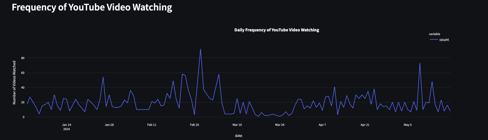
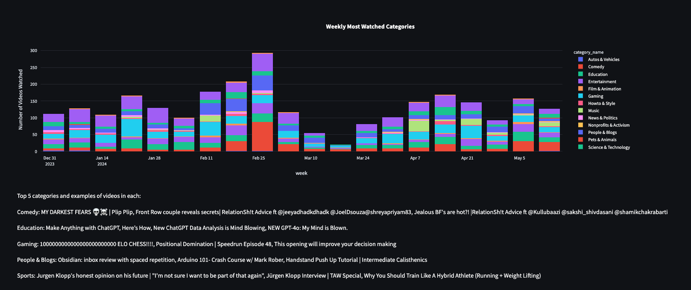
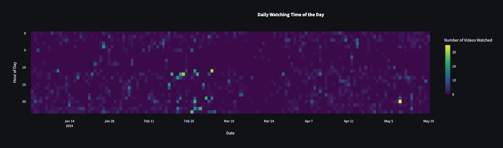
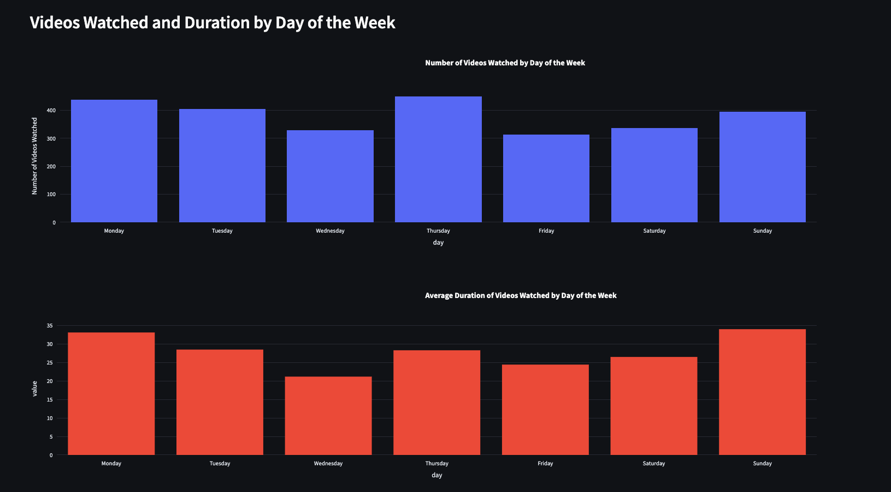
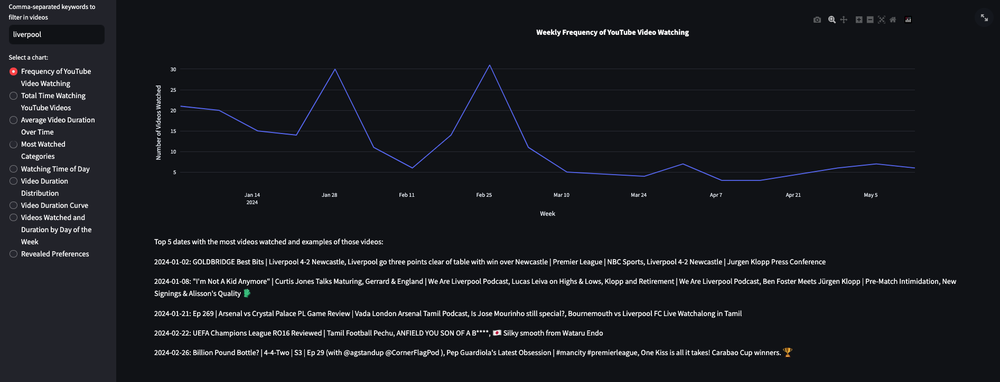
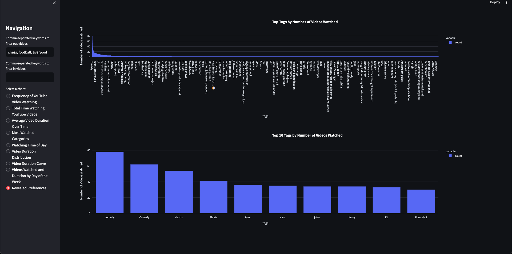

# YouTube Watch History Analysis

This Streamlit dashboard provides insights into your YouTube watch history.

## Pre-requisites
Your YouTube Watch History must be switched on.

## Installation

1. Clone the repository:
   ```bash
   git clone https://github.com/sundarm710/youtube-watch-history-analysis.git
   cd youtube-watch-history-analysis
2. Create a virtual environment and activate it:
python -m venv venv
source venv/bin/activate  # On Windows, use `venv\Scripts\activate`
3. Install the packages `pip install -r requirements.txt`

# Download Your YouTube Watch History
- Search for Google Takeout and choose your primary account.
- Select Deselect all.
- Scroll down and select YouTube and YouTube Music. Click on the dropdown arrow to select specific data.
- Ensure History is checked, then click Next step.
- Choose your delivery method, file type, and frequency (you can leave the default options).
- Click Create export.
- Once the export is complete, download the .zip file provided by Google.
- Extract the downloaded .zip file. You will find a file named watch-history.html in the extracted folder.
- Replace the watch-history.html file with yours.

# Run the streamlit app
`streamlit run src/index.py`

# Insights
Your Youtube viewing history by date


The category of videos you watch


The hours of the day


Breakdown by days of the week


Filter for only some keywords to get their trends


Filter out certain keywords and see trends

